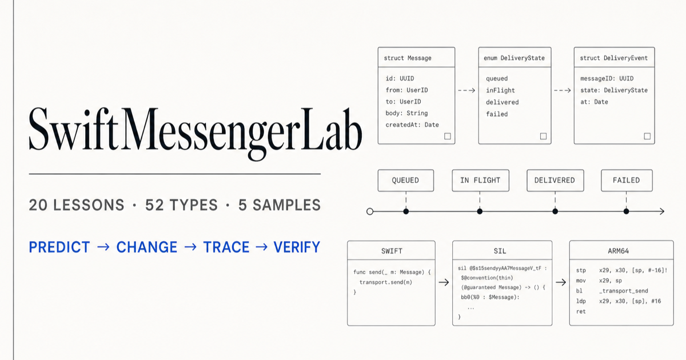

# SwiftMessengerLab

[](https://github.com/estelledc/SwiftMessengerLab/actions/workflows/pages.yml)
[](CHANGELOG.md)
[](LICENSE)

一个公开、原创、可离线运行的 Swift/UIKit IM 学习实验室。App 有两个入口：`Messenger` 用于追踪发送、失败和重试，`Learn` 用 20 节短课、52 张类型卡和 5 个编译器样本学习 Swift、Foundation、UIKit 与业务类型。

[项目展示页](https://estelledc.github.io/SwiftMessengerLab/) · [20 节课程](docs/20-session-curriculum.md) · [类型实验室](docs/type-lab.md) · [编译器显微镜](docs/compiler-lab.md)



展示页使用与 [Jason Xun 主站](https://estelledc.github.io/) 相同的 Jason DS 2.2.0 vendor copy：共享纸白/墨黑双主题、排版、状态、导航、证据来源和页脚契约；项目只保留类型搜索、编译器流水线与真实 Simulator 截图等领域组件。

## 它解决什么问题

零基础学习 API 时，最难的通常不是记名字，而是把名字放回一次真实变化中：

```text
预测 -> App 控件改值 -> 观察预览/日志 -> LLDB 改当前实例
     -> 修改源码默认值 -> 解释类型、所有权和控制流 -> 检索题验证
```

Messenger 把常见 IM 客户端问题压缩成一条本地链路：

```text
会话列表 -> 输入文本 -> Repository 乐观插入 -> Mock Transport
         -> sent / failed -> 同一 message id 重试 -> JSON Cache
```

项目不连接真实聊天服务，也不复刻任何商业客户端。示例会话、消息和服务器回执均为虚构本地数据。

## 5 分钟运行

要求：macOS、Xcode 16+、iOS 17+ Simulator。App target 保持 Swift 5 language mode；Core 使用 Swift Package Manager 测试。

```bash
git clone https://github.com/estelledc/SwiftMessengerLab.git
cd SwiftMessengerLab
make build
make run
```

如果本机没有默认的 `iPhone 17 Pro`：

```bash
make build SIMULATOR_NAME="你的 Simulator 名称"
```

打开 Xcode：

```bash
make open
```

## 第一个业务实验

1. 打开任意会话，先预测普通消息的状态顺序。
2. 发送普通文本，观察 `queued → sending → sent`。
3. 发送 `/fail`，观察 `sending → failed`。
4. 点击失败消息，确认同一个 `Message.id` 重试后变为 `sent`。
5. 打开 `Logs`，复述 `UI → Repository → Transport → Repository → UI`。

## 第一个类型实验

1. 切到 `Learn`，搜索 `UIView` 或进入第 11 课。
2. 打开类型卡，指出它是 `class`，再选一个属性和一个方法。
3. 在 App 中改变 `alpha / backgroundColor / isHidden`，观察预览和日志。
4. 按类型卡给出的 LLDB 命令修改当前实例。
5. 修改指定源码默认值并重新运行，解释为什么源码改值会影响新实例。

类型卡可以自由查看；进度只记录“已操作 / 已回答”，不会把点击冒充掌握。`Reset Experiment`、`Reset Learning Progress` 和 Messenger JSON Cache 相互独立。

## 52 张类型卡

- Swift 与业务基础：属性、方法、值/引用、Optional、enum、protocol、closure 与 ARC。
- Swift / Foundation：常用集合、UUID、Date、URL、Data、FileManager、Task 与 Result。
- UIKit：应用与 scene 链、view/layout、controller/navigation、展示控件、输入与列表。
- IM 映射：AppEnvironment、Repository、Transport、Cache、Message、Snapshot 和发送状态。

非类型的语法机制使用独立的 `LanguageConcept`，不会伪装成 `struct`。每个真实类型在全局 `TypeCatalog` 中只有一个 ID，课程只保存引用。

## 编译器显微镜

```bash
make compiler-lab SAMPLE=property-access
make compiler-lab SAMPLE=method-dispatch MODE=optimized
make compiler-test
```

五个小于等于 20 行的纯 Swift 样本分别观察：属性访问、值与引用、方法派发、闭包捕获、enum 状态机。命令会生成 SILGen、canonical SIL、LLVM IR、Debug/Optimized ARM64 汇编和 demangle 片段；生成物位于忽略目录。

## 项目结构

```text
SwiftMessengerLab/
├── SwiftMessengerLab/
│   ├── App/                    # Scene 与依赖组装
│   ├── Core/                   # Foundation-only 模型、目录、仓库、传输、缓存
│   ├── Features/               # Inbox 与 Chat
│   └── Learning/               # 搜索、类型卡和白名单实验
├── CompilerLab/Samples/        # 5 个最小编译器样本
├── Tests/                      # 9 个 Core 测试场景
├── SwiftMessengerLabUITests/   # 9 个真实 UI 场景
├── docs/                       # 课程文档与 GitHub Pages
└── scripts/                    # compiler / public / showcase 门禁
```

## 固定命令

```bash
make test              # 9 个 Core 场景
make test-ui           # 9 个 Simulator UI 场景
make compiler-test     # 5 个编译器样本
make build             # iOS Simulator build
make verify-showcase   # Pages 资源、Jason DS、指标、链接和 action pin
make public-scan       # 公开边界扫描
make check             # 不含 UI 的日常门禁
make release-check     # 含 UI 的发布门禁
```

## 公开边界与限制

- 只使用公开 API、公开资料和原创实现。
- 不包含内部源码、接口、类型名、文档标识、凭证或本机路径。
- 不逆向 UIKit 二进制；底层观察只针对仓库中的最小 Swift 样本。
- 1.0.0 不覆盖真实后端、账号、附件、推送、加密、动画、手势、多媒体、SwiftUI 或 Objective-C 混编。
- 发布物是源码和 GitHub Pages，不提供 IPA，也不进入 App Store/TestFlight。

完整约束见 [Public Research Boundary](docs/public-research-boundary.md)。贡献方式见 [CONTRIBUTING.md](CONTRIBUTING.md)，安全问题见 [SECURITY.md](SECURITY.md)。
